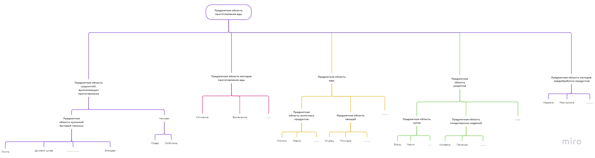

# Предметная область. Приготовление еды

Процесс **приготовления еды** - процесс преобразования набора **продуктов** в готовую к употреблению **пищу**. 
Данный процесс выполняет **человек**, обладающий минимальными навыками **кулинарии**, а также знаниями о **рецептах**, по которым и будет производиться **приготовление еды**. **Еда** бывает **домашней** и **ресторанной**, соответственно, одну может *готовить* любой **человек** в домашних или природных условиях, а вторую - **повар**.

Для того, чтобы *приготовить* **еду**, необходимо следующее:
- выбрать **рецепт**, по которому будет производиться **приготовление еды**;
- *обработать* **ингредиенты** (*разморозить*, *почистить*, *промыть*, *процедить*, *нарезать* и т.д.);
- воспользоваться одним из **методов приготовления пищи** (*кипячение*, *консервирование*, *копчение*, *выпекание* и т.д.);
- *подать еду* для ее дальнейшего **употребления**.

При выполнении всех вышеперечисленных процессов **человеку** понадобятся инструменты: **посуда** (**ножи**, **кастрюли**, **сковородки** и т.д.) и **кухонная бытовая техника** (**плита**, **духовой шкаф** и т.д.).

В соответствии с данным описанием можно выстроить следующую структуру иерархии предметных областей внутри предметной области приготовления еды:

Для удобства ссылка на данную структуру: [https://miro.com](https://miro.com/welcomeonboard/UXNvNmpSNEEyWWRtWWpIaWFSbjk4NmpnQUFDSUtOSHNPZVR4NnMxYWcwM3ZtVVZLQXdQUW4yVGJwd0hoRzM3aHwzMDc0NDU3MzQ3OTA3MDc1NDA5fDI=?share_link_id=513515211947)

Минимальный набор понятий и отношений определяется, исходя из специфики предметной области. Например, если это ПрО **приготовления еды** в **ресторане**, то набор будет включать себя одни понятия, а если ПрО **приготовления омлета**, то совсем другие. Но есть несколько понятий, без которых прдеметная область **приготовления еды** существовать не сможет:

- понятия:
    - **человек**
    - **продукт**
    - **посуда**
- отношения:
    - *готовить*